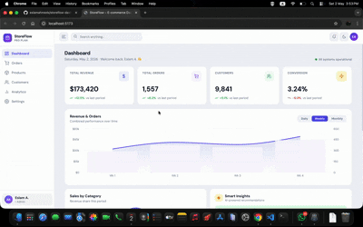
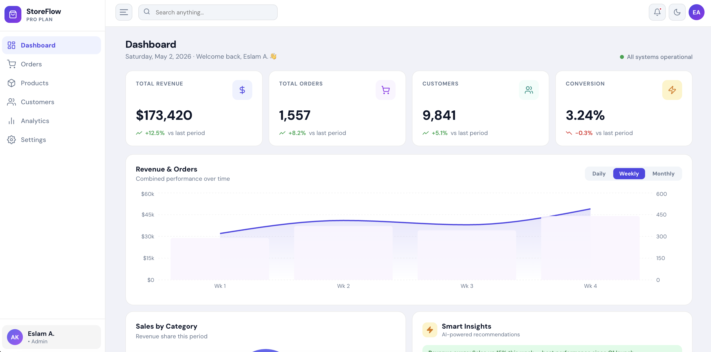
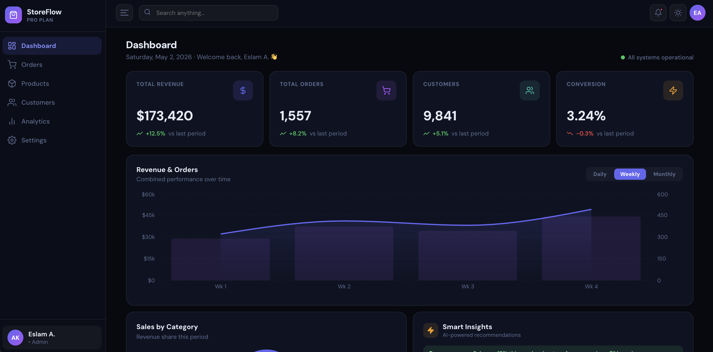
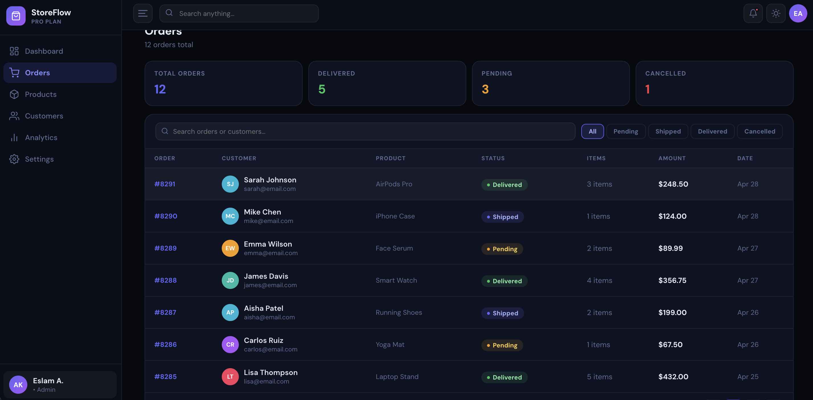
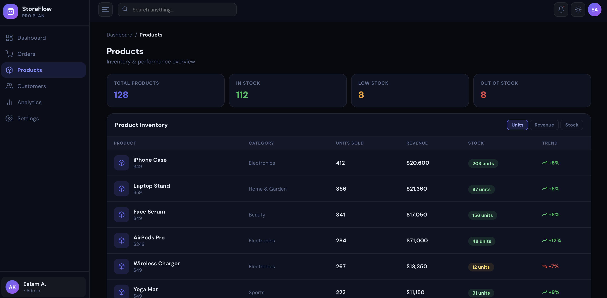
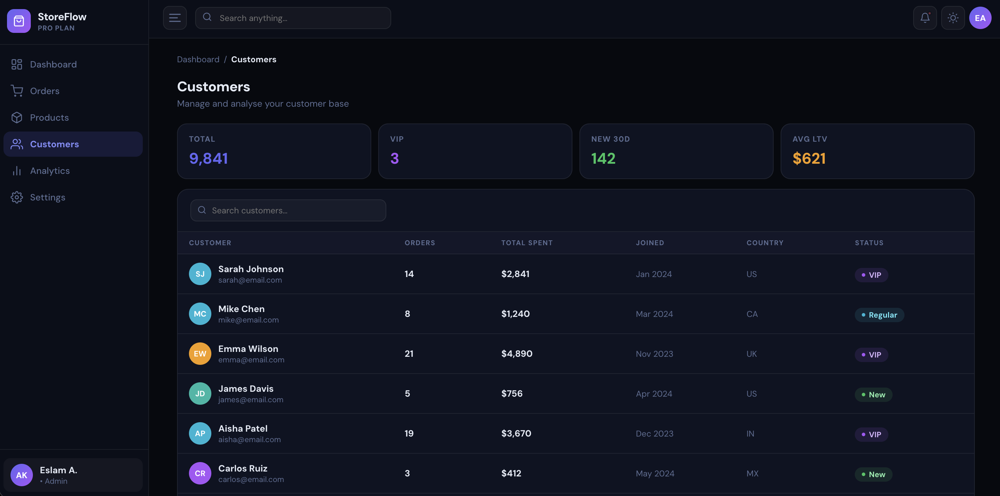
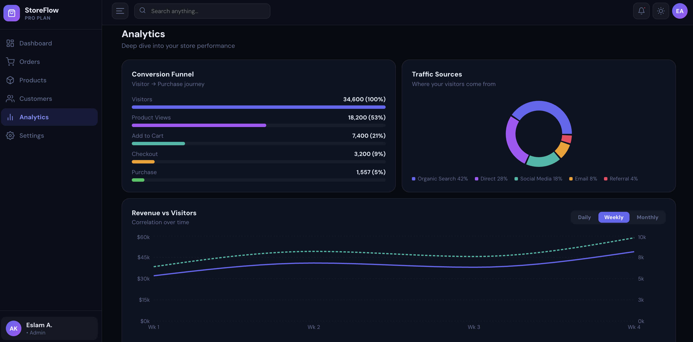
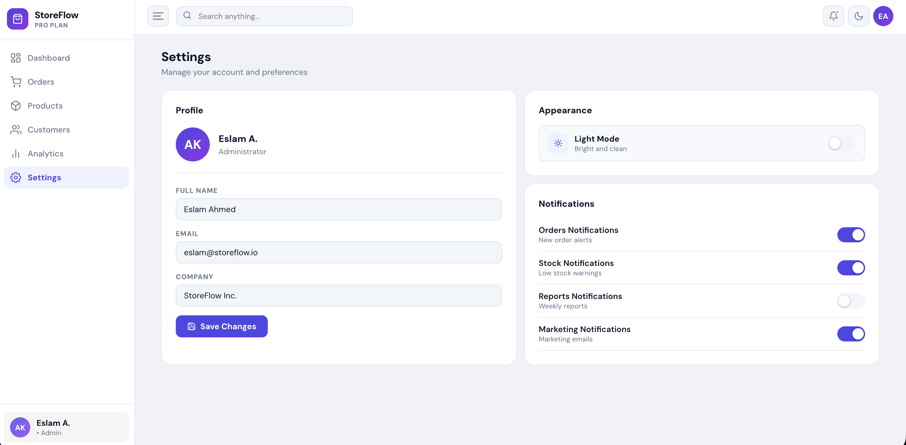
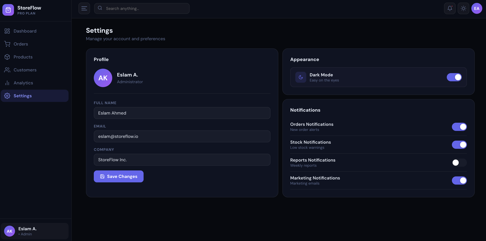

#  StoreFlow Dashboard

<p align="center">
  <b>Modern E-commerce Dashboard built with React + Vite + Recharts</b>
</p>

<p align="center">
  
</p>

---

## 👨‍💻 Author
**Eslam Ahmed**

---

## 🎬 Live Preview (GIF)

<p align="center">
  <!-- Replace with your actual GIF -->
  
</p>

---

## 📸 Screenshots

---

### 🏠 Dashboard

#### 🌞 Light Mode
<p align="center">
  
</p>

#### 🌙 Dark Mode
<p align="center">
  
</p>

---

### 📋 Orders

<p align="center">
  
</p>

---

### 🛍 Products

<p align="center">
  
</p>

---

### 👥 Customers

<p align="center">
  
</p>

---

### 📊 Analytics

<p align="center">
  
</p>

---

### ⚙️ Settings

#### 🌞 Light Mode
<p align="center">
  
</p>

#### 🌙 Dark Mode
<p align="center">
  
</p>

---

## ✨ Features

- 🌙 **Dark / Light Mode** — Smooth toggle with persistence  
- 📊 **Advanced Charts** — Multiple data visualization types  
- 📋 **Orders Management** — Search, filtering, pagination  
- 🧠 **Smart Insights** — Clean analytics cards  
- 🔔 **Notifications System**  
- 📱 **Responsive Design**  
- ⚙️ **Settings Panel**  
- 🎨 **Modern UI System**

---

## 🛠 Tech Stack

| Tech | Description |
|------|------------|
| ⚛️ React 18 | Frontend library |
| ⚡ Vite | Fast build tool |
| 📊 Recharts | Charts |
| 🎯 Lucide | Icons |
| 🎨 CSS-in-JS | Styling |

---

## 📁 Project Structure

```
src/
├── App.jsx
├── main.jsx
│
├── context/
│   └── ThemeContext.jsx
│
├── data/
│   └── mockData.js
│
├── components/
│   ├── layout/
│   │   ├── Sidebar.jsx
│   │   └── Navbar.jsx
│   │
│   ├── ui/
│   │   ├── index.jsx
│   │   └── KPICard.jsx
│   │
│   ├── charts/
│   │   └── index.jsx
│   │
│   └── pages/
│       ├── DashboardPage.jsx
│       ├── OrdersPage.jsx
│       └── OtherPages.jsx
```

---

## 🚀 Getting Started

```bash
git clone https://github.com/your-username/storeflow-dashboard.git
cd storeflow-dashboard
npm install
npm run dev
```

👉 http://localhost:5173

---

## 🏗 Build

```bash
npm run build
npm run preview
```

---

## ⚙️ Customization

- Replace mock data → `src/data/mockData.js`
- Add routing → `react-router-dom`
- Persist theme → `localStorage`
- Add Tailwind (optional)

---

## 📄 License

This project is licensed under the MIT License.  
© 2026 Eslam Ahmed

---

## ⭐ Support

If you like this project, consider giving it a ⭐ on GitHub!